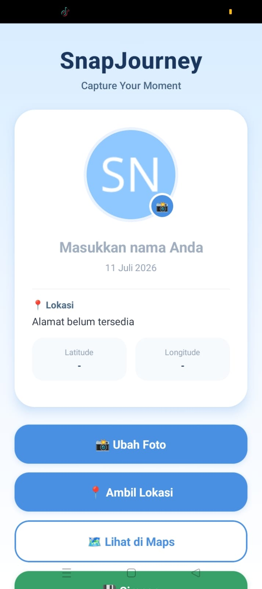
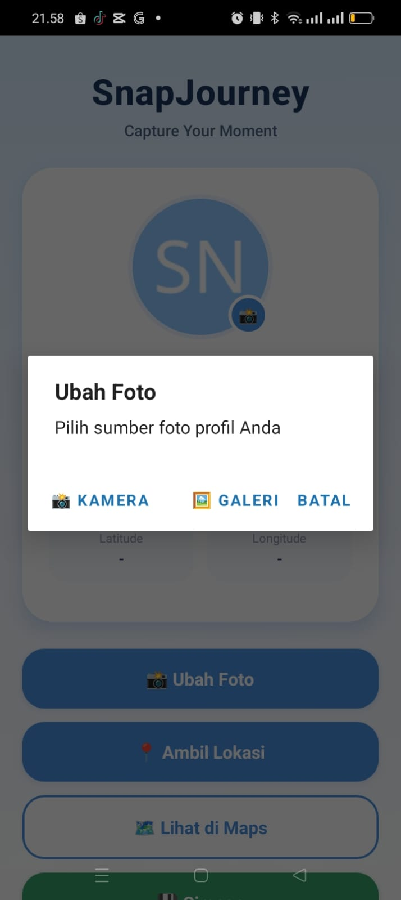
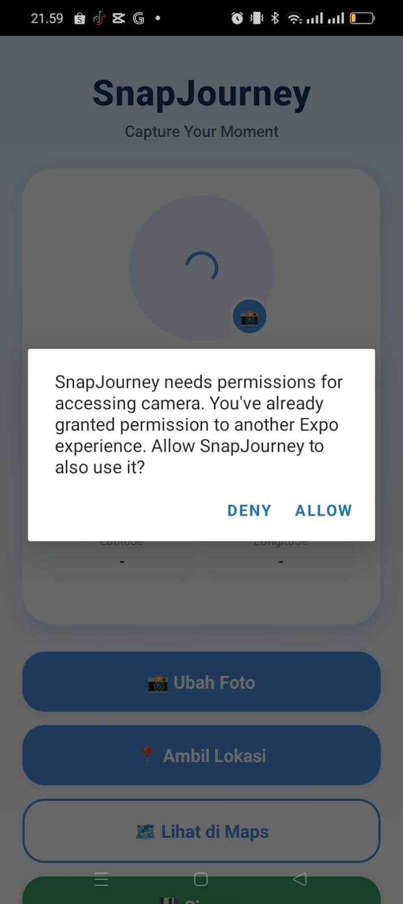
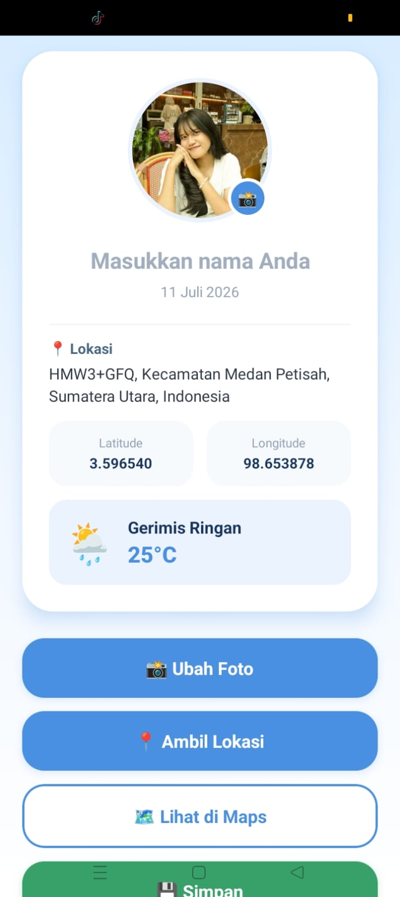
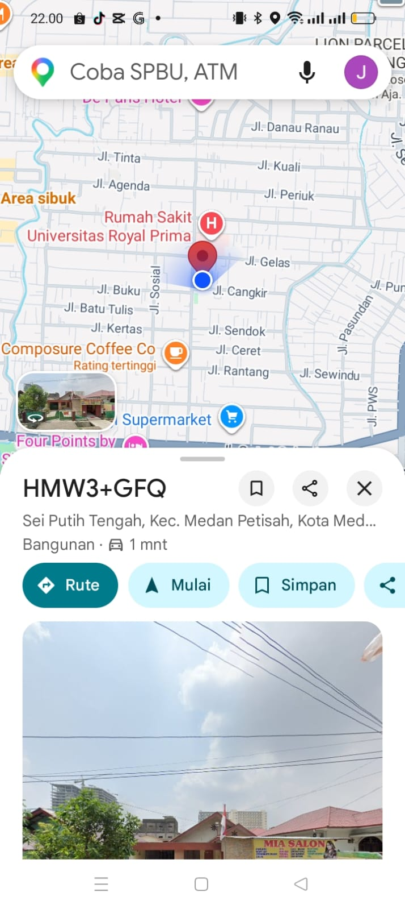
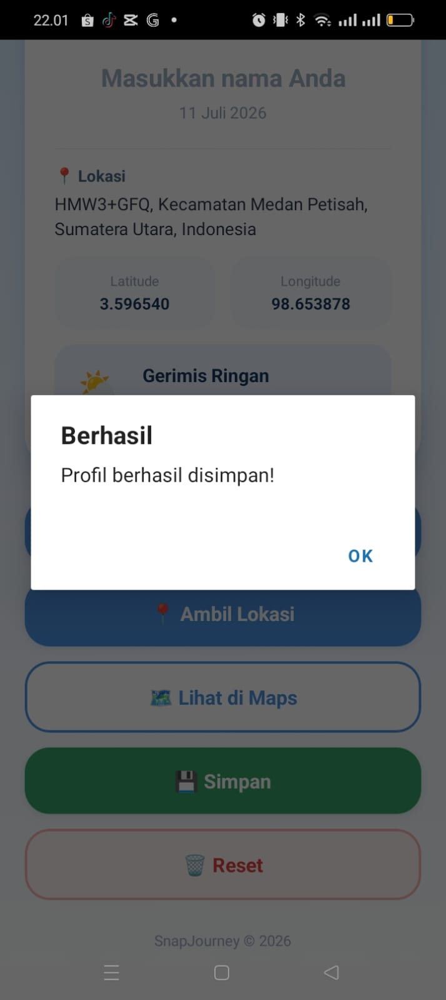
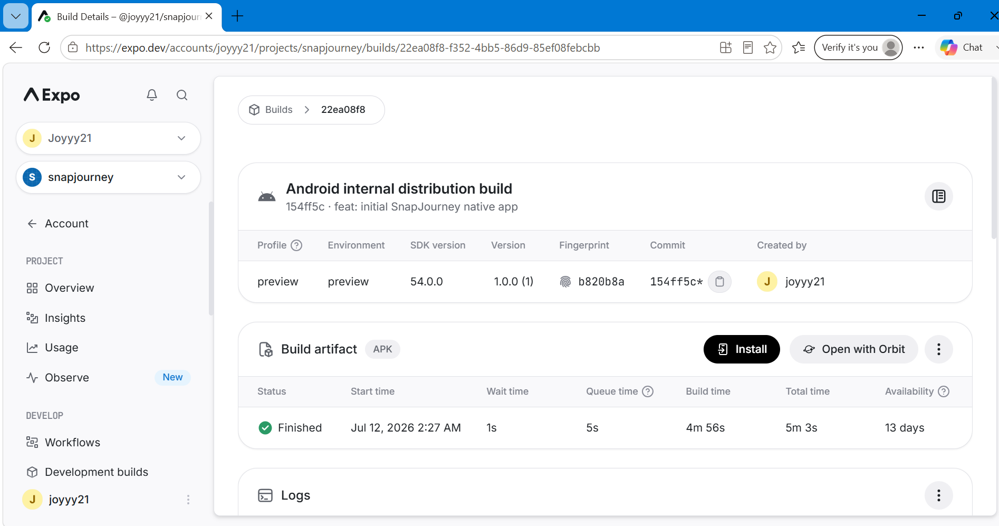
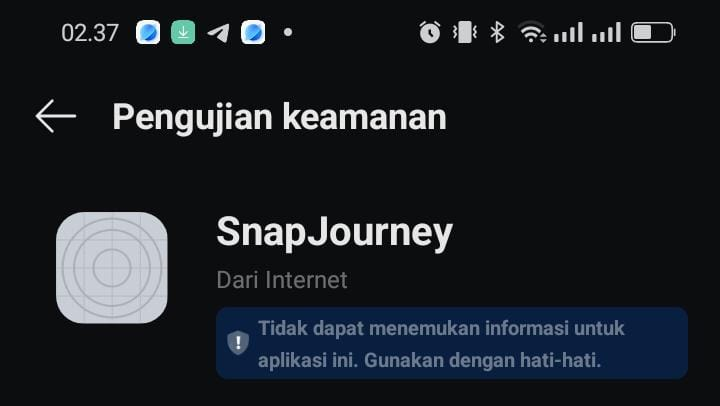
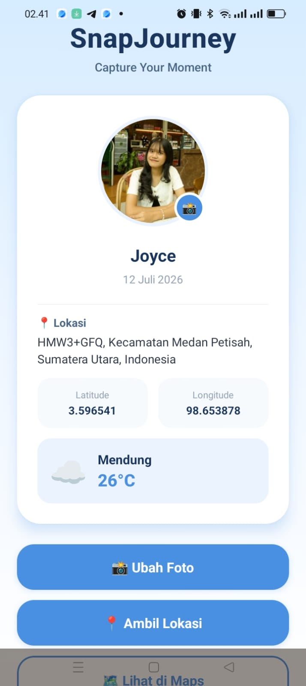

# 📸 SnapJourney

**Capture Your Moment**

SnapJourney adalah aplikasi mobile berbasis **React Native** menggunakan **Expo SDK 54** yang memanfaatkan fitur native smartphone seperti **kamera, galeri, dan GPS**. Aplikasi ini memungkinkan pengguna mengambil atau memilih foto profil, mendapatkan lokasi saat ini, melihat alamat lengkap, membuka lokasi di Google Maps, serta menyimpan data menggunakan AsyncStorage.

---

## ✨ Features

### ✅ Level 1 (Core Features)

- 📸 Camera
- 🖼️ Gallery
- 📍 GPS Location
- 🔐 Permission Flow
- 🚫 Graceful Permission Denied Handling
- 🖼️ Display Selected Image
- 🌍 Display Latitude & Longitude

---

### ✅ Level 2 Features

- 📸 Camera & Gallery Selection
- 📍 Photo + Current Location
- 💾 AsyncStorage Persistence
- 🗺️ Open Location in Google Maps
- ⚙️ Open Device Settings when Permission Denied

---

### ⭐ Bonus Features

- 🏠 Reverse Geocoding (Address)
- 🌤️ Current Weather (Open-Meteo API)
- 🗑️ Reset Profile Data

---

# 📱 Screenshots

## Home Screen



---

## Camera / Gallery Option



---

## Camera Permission



---

## Current Location



---

## Google Maps



---

## Saved Data



---

# 🛠️ Tech Stack

- React Native
- Expo SDK 54
- JavaScript
- Expo Image Picker
- Expo Location
- Expo Linking
- Expo Linear Gradient
- AsyncStorage
- Open-Meteo API

---

# 📦 Installation

Clone repository

```bash
git clone https://github.com/Joyyy216/snapjourney-native-app.git
```

Masuk ke folder project

```bash
cd snapjourney-native-app
```

Install dependency

```bash
npm install
```

Jalankan aplikasi

```bash
npx expo start
```

Scan QR Code menggunakan **Expo Go**.

---

# 📂 Project Structure

```
SnapJourney
│
├── assets
├── screenshots
├── App.js
├── app.json
├── package.json
└── README.md
```

---

# 🧪 Testing

✔ Camera Access

✔ Gallery Access

✔ GPS Location

✔ Permission Flow

✔ Image Preview

✔ Latitude & Longitude

✔ Reverse Geocoding

✔ Google Maps

✔ AsyncStorage

✔ Reset Data

---

# 📷 Native Features Used

- Camera
- Gallery
- GPS
- Google Maps
- Device Permission
- Local Storage

---

# 📌 Expo Snack

(https://snack.expo.dev/@joyyy21/snapjourney---mission-13-native-power-app)

---

# 👩‍💻 Developer

---

# 🚀 Release Candidate (Mission 14)

Aplikasi ini telah melalui proses **build release** menggunakan **EAS Build**, menghasilkan APK yang dapat diinstal langsung di HP Android tanpa memerlukan Expo Go.

## 📦 Versi Release

| Item | Nilai |
|---|---|
| Version | `1.0.0` |
| Version Code (Android) | `1` |
| SDK Version | `54.0.0` |
| Build Profile | `preview` |
| Build Type | APK (internal distribution) |

## ⬇️ Download APK

**[Download SnapJourney v1.0.0 (APK)](https://expo.dev/artifacts/eas/qr_HqsWfWYhZhzKgMS0r_9W0NTemWNob0s_j9VA5smo.apk)**

> ⚠️ **Catatan:** Link artifact APK dari EAS Build memiliki masa berlaku terbatas (±13 hari sejak build dibuat, per kebijakan free tier EAS). Jika link sudah tidak dapat diakses, silakan build ulang menggunakan `eas build --platform android --profile preview` mengikuti konfigurasi `eas.json` pada repository ini.

## 🛠️ Proses Build (Ringkasan)

1. Konfigurasi `app.json` dirapikan untuk standar release: menambahkan `android.versionCode`, migrasi `splash` ke plugin `expo-splash-screen`, dan menghapus permission yang tidak digunakan.
2. Membuat `eas.json` dengan profile `preview` yang menghasilkan build bertipe APK.
3. Autentikasi dan inisialisasi project lewat `eas login` dan `eas init`, menghasilkan `projectId` unik yang tersimpan di `app.json`.
4. Menjalankan `eas build --platform android --profile preview` — build dikompilasi di server EAS Build.
5. APK diunduh dan diinstal langsung di perangkat Android fisik untuk pengujian akhir.

## 🖼️ Dokumentasi Build & Instalasi

### Build Status: Finished



### Proses Instalasi APK di HP



### Aplikasi Berjalan (Native, Tanpa Expo Go)



## ✅ Checklist Pengujian Release

| No | Pengujian | Status |
|---|---|---|
| 1 | APK berhasil diinstal di perangkat Android | ✅ |
| 2 | Splash screen tampil sesuai desain | ✅ |
| 3 | Fitur kamera & galeri berfungsi | ✅ |
| 4 | GPS & reverse geocoding berfungsi | ✅ |
| 5 | Data cuaca (Open-Meteo) tampil | ✅ |
| 6 | AsyncStorage menyimpan data dengan benar | ✅ |
| 7 | Google Maps terbuka dari aplikasi | ✅ |
| 8 | Aplikasi berjalan mandiri tanpa Expo Go | ✅ |

---

---

# 📄 License

This project was created for **Mission 13 - Native Power App** in the Mobile Programming course.
